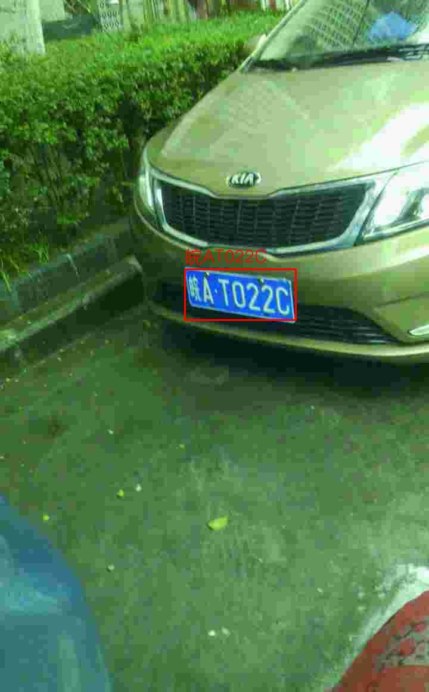

<!-- <div align="right">
  Language:
    🇺🇸
  <a title="Chinese" href="./README.zh-CN.md">🇨🇳</a>
</div> -->

<div align="center"><a title="" href="https://github.com/zjykzj/LPDet"></a></div>

<p align="center">
  «LPDet» provides a complete License Plate Detection and Recognition algorithm
<br>
<br>
  <a href="https://github.com/RichardLitt/standard-readme"></a>
  <a href="https://conventionalcommits.org"></a>
  <a href="http://commitizen.github.io/cz-cli/"></a>
</p>

## Table of Contents

- [Table of Contents](#table-of-contents)
- [Latest News](#latest-news)
- [Background](#background)
- [Prepare Data](#prepare-data)
- [Installation](#installation)
- [Usage](#usage)
  - [Train](#train)
  - [Eval](#eval)
  - [Predict](#predict)
- [Maintainers](#maintainers)
- [Thanks](#thanks)
- [Contributing](#contributing)
- [License](#license)

## Latest News

* ***[2023/09/29][v0.1.0](https://github.com/zjykzj/LPDet/releases/tag/v0.1.0). Reconstruct the [872699467/CCPD_CNN](https://github.com/872699467/CCPD_CNN) implementation to adapt to interfaces after Pytorch v1.0.0.***

## Background

This warehouse provides a complete license plate detection and recognition algorithm, with the goal of perfectly detecting and recognizing all license plates and license plate information.

## Prepare Data

* Download CCPD2019: [BaiduYun Drive(code: ol3j)](https://pan.baidu.com/share/init?surl=JSpc9BZXFlPkXxRK4qUCyw)

## Installation

```shell
$ pip install -r requirements.txt
```

## Usage

### Train

* Train Dataset: `CCPD2019/ccpd_base`
* Validate Dataset: `CCPD2019/ccpd_weather`

Firstly, train the license plate detection model: `wR2`

```shell
python train_wr2.py ../datasets/CCPD2019/ccpd_base/ ../datasets/CCPD2019/ccpd_weather/ runs
```

Then, train both license plate detection and recognition models simultaneously: `RPNet`

```shell
python train_rpnet.py ../datasets/CCPD2019/ccpd_base/ ../datasets/CCPD2019/ccpd_weather/ runs
```

### Eval

```shell
$ python eval_wr2.py /data/sdd/CCPD2019/ccpd_weather/
args: Namespace(val_root='/data/sdd/CCPD2019/ccpd_weather/')
Loading wR2 pretrained: runs/wR2-e45.pth
Get Data: /data/sdd/CCPD2019/ccpd_weather/
9999it [00:00, 39176.07it/s]
Dataset len: 9999
Batch:312 AP:100.000: 100%|████████████████████████████| 313/313 [01:22<00:00,  3.82it/s]
AP:97.760
```

```shell
$ CUDA_VISIBLE_DEVICES=9 python eval_rpnet.py /data/sdd/CCPD2019/ccpd_weather/
args: Namespace(val_root='/data/sdd/CCPD2019/ccpd_weather/')
Loading wR2 pretrained: runs/wR2-e45.pth
Loading RPNet pretrained: runs/RPNet-e60.pth
Get Data: /data/sdd/CCPD2019/ccpd_weather/
9999it [00:00, 29083.24it/s]
Dataset len: 9999
Batch:312 AP:100.000 ACC: 100.000: 100%|█████████████████████████████████████| 313/313 [01:18<00:00,  4.00it/s]
AP:95.840 ACC: 97.080
```

### Predict

```shell
$ python predict_wr2.py assets/2.jpg runs/wR2-e45.pth 
args: Namespace(image='assets/2.jpg', wr2='runs/wR2-e45.pth')
Loading wR2 pretrained: runs/wR2-e45.pth
torch.Size([1, 4])
Save to runs/2_wr2.jpg
```


```
$ python predict_rpnet.py ./assets/2.jpg ./runs/RPNet-e60.pth 
args: Namespace(image='./assets/2.jpg', rpnet='./runs/RPNet-e60.pth')
Loading RPNet pretrained: ./runs/RPNet-e60.pth
torch.Size([1, 242])
lp_name: 皖AT022C
Save to runs/2_rpnet.jpg
```



## Maintainers

* zhujian - *Initial work* - [zjykzj](https://github.com/zjykzj)

## Thanks

* [detectRecog/CCPD](https://github.com/detectRecog/CCPD)
* [872699467/CCPD_CNN](https://github.com/872699467/CCPD_CNN)

## Contributing

Anyone's participation is welcome! Open an [issue](https://github.com/zjykzj/LPDet/issues) or submit PRs.

Small note:

* Git submission specifications should be complied
  with [Conventional Commits](https://www.conventionalcommits.org/en/v1.0.0-beta.4/)
* If versioned, please conform to the [Semantic Versioning 2.0.0](https://semver.org) specification
* If editing the README, please conform to the [standard-readme](https://github.com/RichardLitt/standard-readme)
  specification.

## License

[Apache License 2.0](LICENSE) © 2023 zjykzj