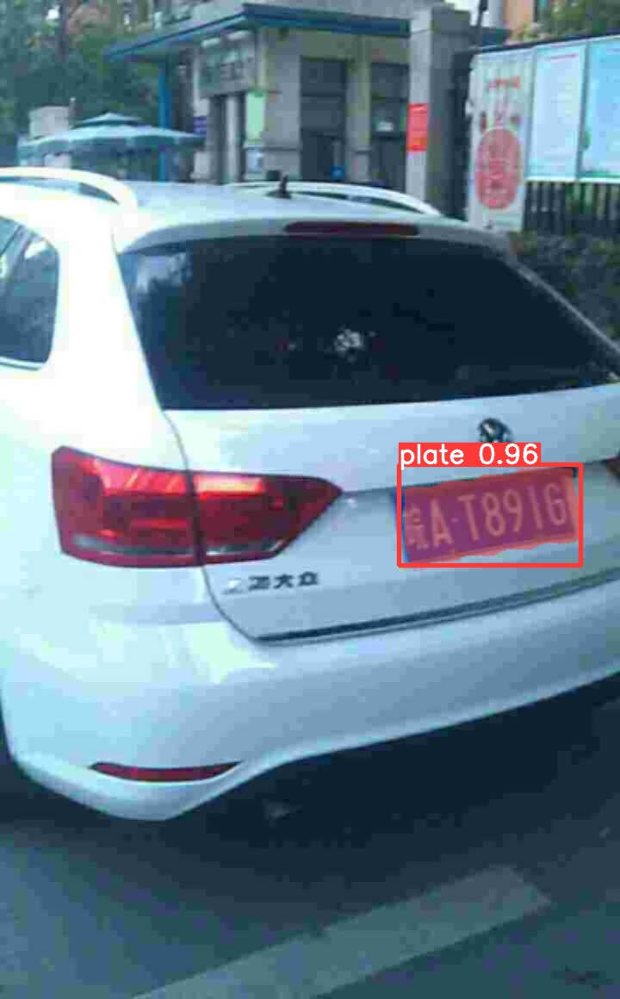
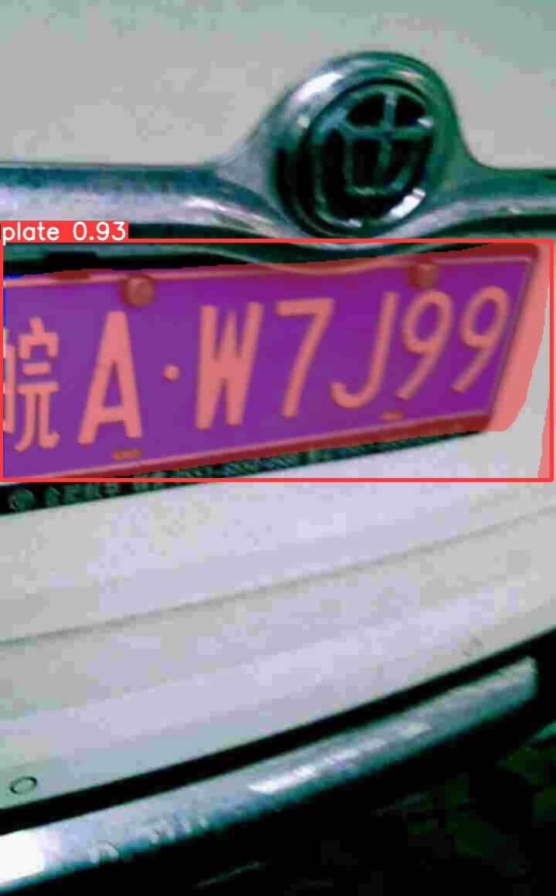
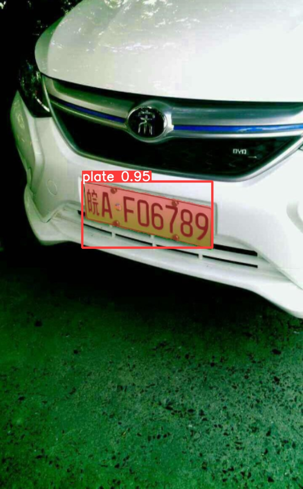
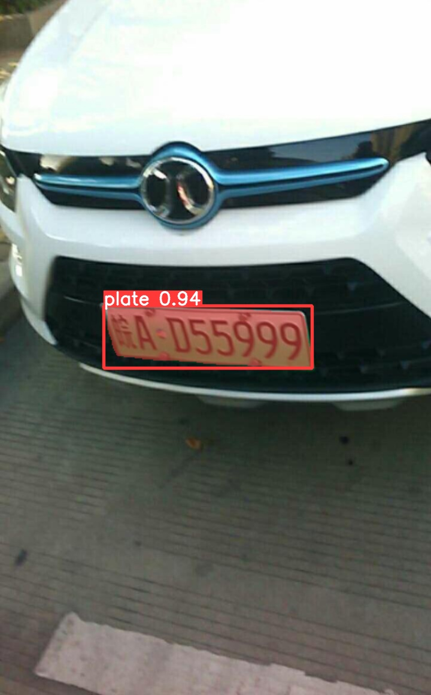
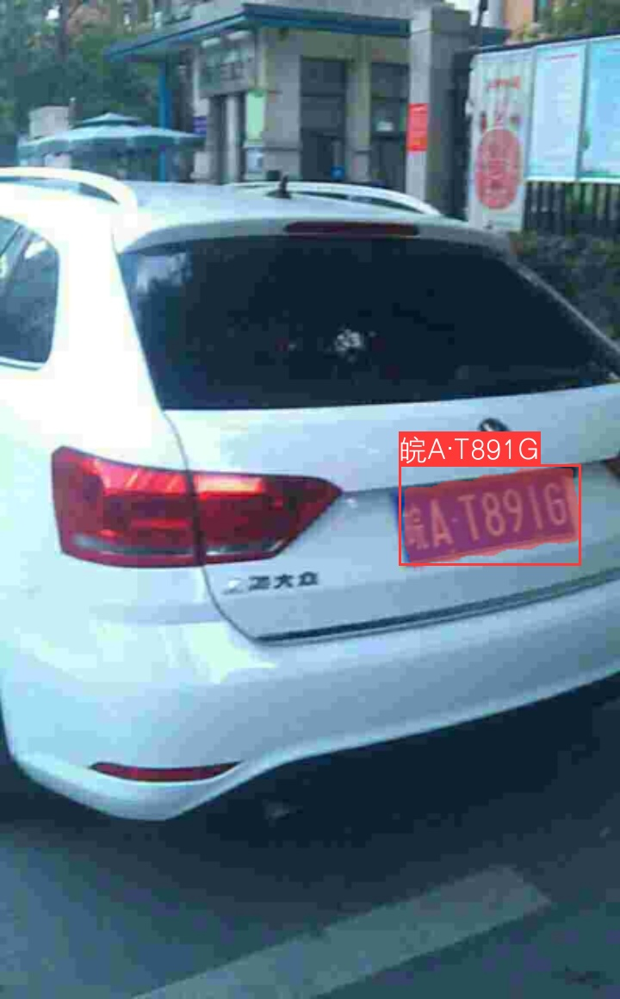
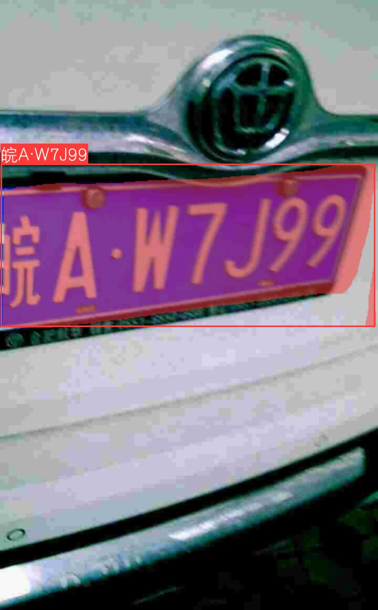
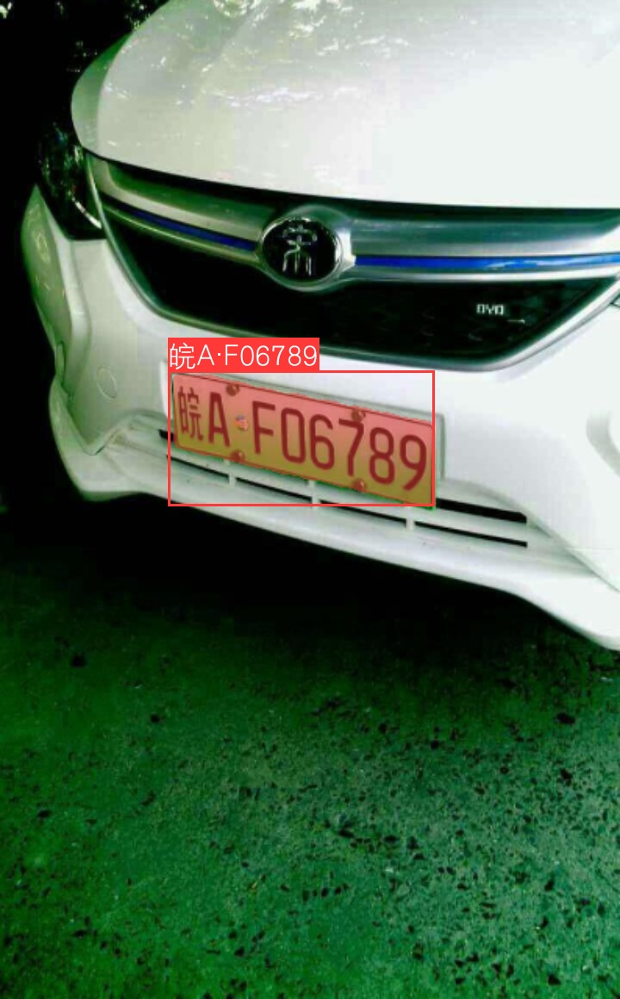
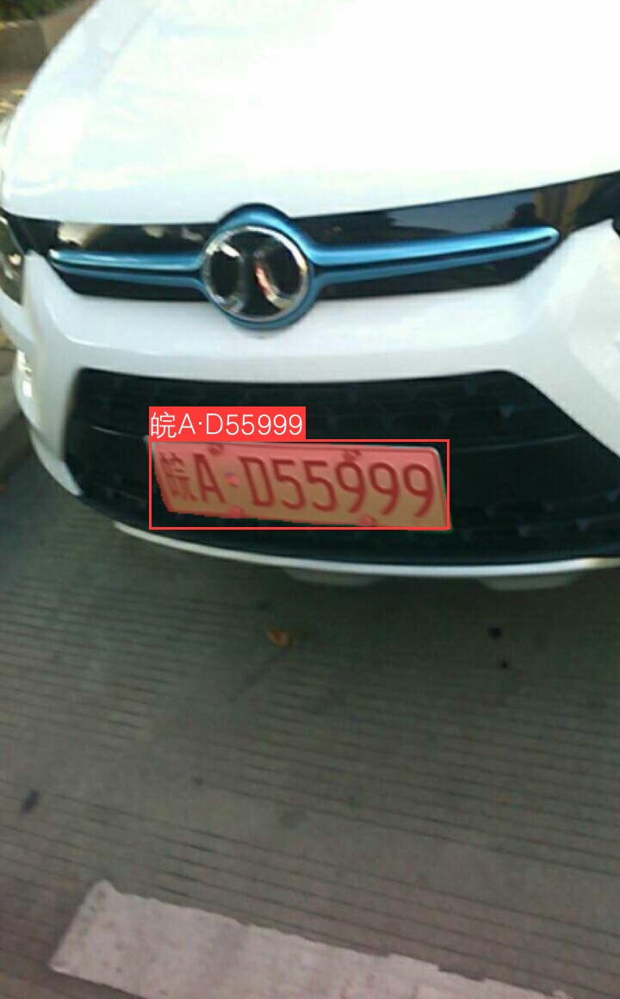

<!-- <div align="right">
  Language:
    🇺🇸
  <a title="Chinese" href="./README.zh-CN.md">🇨🇳</a>
</div> -->

<div align="center"><a title="" href="https://github.com/zjykzj/LPDet"></a></div>

<p align="center">
  «LPDet» provides a complete License Plate Detection and Recognition algorithm
<br>
<br>
  <a href="https://github.com/RichardLitt/standard-readme"></a>
  <a href="https://conventionalcommits.org"></a>
  <a href="http://commitizen.github.io/cz-cli/"></a>
</p>

ONLINE DEMO：[LICENSE PLATE DETECT/SEGMENT/RECOG](https://blog.zjykzj.cn/gradio/plate_lpdet/)

Implementing license plate detection, segmentation, and recognition functions based on [ultralytics/yolov5 v7.0](https://github.com/ultralytics/yolov5/releases/tag/v7.0) and [zjykzj/crnn-ctc](https://github.com/zjykzj/crnn-ctc)

| **Model<br>Segmentation** | **Input Shape** | **GFLOPs** | **Model Size (MB)** | **Speed<br>RTX 3090 b1<br>(ms)** |  **ChineseLicensePlate<br>mAP50 (%)**   | **Training Data** | **Testing Data** |
|:-------------------------:|:---------------:|:----------:|:-------------------:|:--------------------------------:|:---------------------------------------:|:-----------------:|:----------------:|
|      **YOLOv5n-Seg**      |  (3, 640, 640)  |    6.7     |         3.9         |               9.0                |                  99.2                   |      200,579      |     105,585      |
|                           |                 |            |                     |                                  |                                         |                   |                  |
| **Model<br>Recognition**  | **Input Shape** | **GFLOPs** | **Model Size (MB)** | **Speed<br>RTX 3090 b1<br>(ms)** | **ChineseLicensePlate<br>Accuracy (%)** | **Training Data** | **Testing Data** |
|       **CRNN_Tiny**       |  (3, 48, 168)   |    0.3     |         4.0         |               7.5                |                 76.226                  |      269,621      |     149,002      |

## Table of Contents

- [Table of Contents](#table-of-contents)
- [News🚀🚀🚀](#news)
- [Background](#background)
- [Usage](#usage)
  - [Detect + Seg](#detect--seg)
  - [Recog](#recog)
- [Maintainers](#maintainers)
- [Thanks](#thanks)
- [Contributing](#contributing)
- [License](#license)

## News🚀🚀🚀

| Version                                                       | Release Date | Major Updates                                                                                                                           |
|---------------------------------------------------------------|--------------|-----------------------------------------------------------------------------------------------------------------------------------------|
| [v1.2.0](https://github.com/zjykzj/LPDet/releases/tag/v1.2.0) | 2024/08/17   | Add ONNX inference and Gradio demo.                                                                                                     |
| [v1.1.0](https://github.com/zjykzj/LPDet/releases/tag/v1.1.0) | 2024/08/04   | Optimize license plate segmentation and recognition algorithms.                                                                         |
| [v1.0.0](https://github.com/zjykzj/LPDet/releases/tag/v1.0.0) | 2024/07/21   | Implementing license plate detection, segmentation, and recognition functions.                                                          |
| [v0.3.0](https://github.com/zjykzj/LPDet/releases/tag/v0.3.0) | 2023/10/03   | Support for Automatic Mixed Precision (AMP) training.                                                                                   |
| [v0.2.0](https://github.com/zjykzj/LPDet/releases/tag/v0.2.0) | 2023/10/02   | Support for distributed training with multi-GPUs.                                                                                       |
| [v0.1.0](https://github.com/zjykzj/LPDet/releases/tag/v0.1.0) | 2023/09/29   | Reconstruct the [872699467/CCPD_CNN](https://github.com/872699467/CCPD_CNN) implementation to adapt to interfaces after Pytorch v1.0.0. |

## Background

This warehouse provides a complete license plate detection and recognition algorithm, with the goal of perfectly detecting and recognizing all license plates and license plate information.

Note: the latest implementation in our warehouse is entirely based on [ultralytics/yolov5 v7.0](https://github.com/ultralytics/yolov5/releases/tag/v7.0)

## Usage

### Detect + Seg

* ChineseLicensePlate: [Baidu Drive](https://pan.baidu.com/s/1fQh0E9c6Z4satvrEthKevg)(ad7l)

```shell
# Train
$ python segment/train.py --data ChineseLicensePlate-seg.yaml --weights yolov5n-seg.pt --img 640 --epoch 10
# Eval
$ python segment/val.py --weights yolov5n-seg_plate.pt --data ChineseLicensePlate-seg.yaml --img 640
# Predict
$ python segment/predict.py --weights yolov5n-seg_plate.pt --source ./assets/ccpd/
```

   

### Recog

About license plate recognition algorithm, using [zjykzj/crnn-ctc](https://github.com/zjykzj/crnn-ctc)

```shell
$ git submodule init
$ git submodule update
```

Then predicting license plates

```shell
# Using Pytorch
$ python3 segment/predict_plate.py --weights yolov5n-seg_plate.pt --w-for-recog crnn_tiny-plate-b512-e100.pth --source ./assets/ccpd/
# Using ONNXRuntime
$ python3 segment/predict_plate.py --weights yolov5n-seg_plate.onnx --w-for-recog crnn_tiny-plate.onnx --source ./assets/ccpd/ --device cpu
```

   

## Maintainers

* zhujian - *Initial work* - [zjykzj](https://github.com/zjykzj)

## Thanks

* [detectRecog/CCPD](https://github.com/detectRecog/CCPD)
* [872699467/CCPD_CNN](https://github.com/872699467/CCPD_CNN)
* [zjykzj/FastestDet](https://github.com/zjykzj/FastestDet)
* [zjykzj/YOLOv5](https://github.com/zjykzj/YOLOv5)
* [zjykzj/crnn-ctc](https://github.com/zjykzj/crnn-ctc)
* [ultralytics/yolov5](https://github.com/ultralytics/yolov5)

## Contributing

Anyone's participation is welcome! Open an [issue](https://github.com/zjykzj/LPDet/issues) or submit PRs.

Small note:

* Git submission specifications should be complied
  with [Conventional Commits](https://www.conventionalcommits.org/en/v1.0.0-beta.4/)
* If versioned, please conform to the [Semantic Versioning 2.0.0](https://semver.org) specification
* If editing the README, please conform to the [standard-readme](https://github.com/RichardLitt/standard-readme)
  specification.

## License

[Apache License 2.0](LICENSE) © 2023 zjykzj