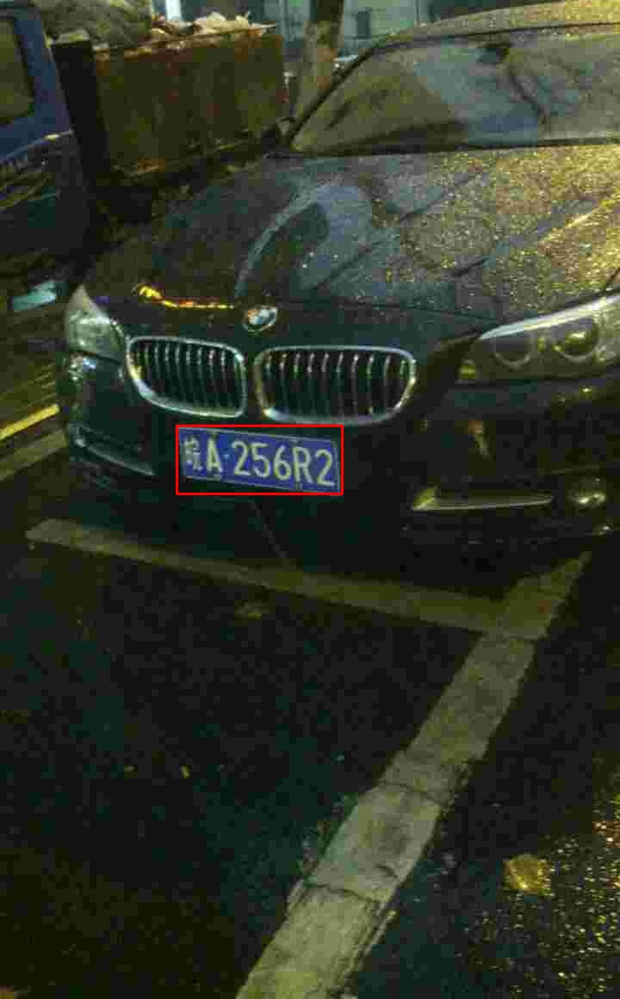

<!-- <div align="right">
  Language:
    🇺🇸
  <a title="Chinese" href="./README.zh-CN.md">🇨🇳</a>
</div> -->

<div align="center"><a title="" href="https://github.com/zjykzj/LPDet"></a></div>

<p align="center">
  «LPDet» provides a complete License Plate Detection and Recognition algorithm
<br>
<br>
  <a href="https://github.com/RichardLitt/standard-readme"></a>
  <a href="https://conventionalcommits.org"></a>
  <a href="http://commitizen.github.io/cz-cli/"></a>
</p>

## Table of Contents

- [Table of Contents](#table-of-contents)
- [Latest News](#latest-news)
- [Background](#background)
- [Prepare Data](#prepare-data)
- [Installation](#installation)
- [Usage](#usage)
  - [Train](#train)
  - [Eval](#eval)
  - [Predict](#predict)
- [Maintainers](#maintainers)
- [Thanks](#thanks)
- [Contributing](#contributing)
- [License](#license)

## Latest News

* ***[2023/10/03][v0.3.0](https://github.com/zjykzj/LPDet/releases/tag/v0.3.0). Support for Automatic Mixed Precision (AMP) training.***
* ***[2023/10/02][v0.2.0](https://github.com/zjykzj/LPDet/releases/tag/v0.2.0). Support for distributed training with multi-GPUs.***
* ***[2023/09/29][v0.1.0](https://github.com/zjykzj/LPDet/releases/tag/v0.1.0). Reconstruct the [872699467/CCPD_CNN](https://github.com/872699467/CCPD_CNN) implementation to adapt to interfaces after Pytorch v1.0.0.***

## Background

This warehouse provides a complete license plate detection and recognition algorithm, with the goal of perfectly detecting and recognizing all license plates and license plate information.

## Prepare Data

* Download CCPD2019: [BaiduYun Drive(code: ol3j)](https://pan.baidu.com/share/init?surl=JSpc9BZXFlPkXxRK4qUCyw)

## Installation

```shell
$ pip install -r requirements.txt
```

## Usage

### Train

* Train Dataset: `CCPD2019/ccpd_base`
* Validate Dataset: `CCPD2019/ccpd_weather`

Firstly, train the license plate detection model: `wR2`

```shell
python -m torch.distributed.run --nproc_per_node 4 --master_port 16233 train_wr2.py --device 4,5,6,7 ../datasets/CCPD2019/ccpd_base ../datasets/CCPD2019/ccpd_weather runs/train
_wr2_ddp
```

Then, train both license plate detection and recognition models simultaneously: `RPNet`

```shell
python -m torch.distributed.run --nproc_per_node 4 --master_port 32312 train_rpnet.py --device 0,1,2,3 --wr2-pretrained runs/train_wr2_ddp/wR2-e95.pth ../datasets/CCPD2019/ccpd_bas
e ../datasets/CCPD2019/ccpd_weather runs/train_rpnet_ddp
```

### Eval

```shell
$ python eval_wr2.py runs/train_wr2_ddp/wR2-e100.pth /data/sdd/CCPD2019/ccpd_weather/
args: Namespace(pretrained='runs/train_wr2_ddp/wR2-e100.pth', val_root='/data/sdd/CCPD2019/ccpd_weather/')
Loading wR2 pretrained: runs/train_wr2_ddp/wR2-e100.pth
Get val data: /data/sdd/CCPD2019/ccpd_weather/
Dataset len: 9999
Batch:312 AP:100.000: 100%|██████████████████████████████████████████████████████████████████████████████████████████████████████████████████████████████████████████████████████| 313/313 [00:53<00:00,  5.89it/s]
AP:96.650
```

```shell
$ python eval_rpnet.py runs/train_rpnet_ddp/RPNet-e100.pth ../datasets/CCPD2019/ccpd_weather/
args: Namespace(pretrained='runs/train_rpnet_ddp/RPNet-e100.pth', val_root='../datasets/CCPD2019/ccpd_weather/')
Loading RPNet pretrained: runs/train_rpnet_ddp/RPNet-e100.pth
Get train data: ../datasets/CCPD2019/ccpd_weather/
Dataset len: 9999
Batch:312 AP:100.000 ACC: 100.000: 100%|█████████████████████████████████████████████████████████████████████████████████████████████████████████████████████████████████████████| 313/313 [00:52<00:00,  5.94it/s]
AP:97.400 ACC: 97.930
```

### Predict

```shell
$ python predict_wr2.py runs/train_wr2_ddp/wR2-e100.pth assets/eval/4.jpg 
args: Namespace(image='assets/eval/4.jpg', wr2='runs/train_wr2_ddp/wR2-e100.pth')
Loading wR2 pretrained: runs/train_wr2_ddp/wR2-e100.pth
torch.Size([1, 4])
Save to runs/4_wr2.jpg
```



```
$ python predict_rpnet.py runs/train_rpnet_ddp/RPNet-e100.pth assets/eval/4.jpg 
args: Namespace(image='assets/eval/4.jpg', rpnet='runs/train_rpnet_ddp/RPNet-e100.pth')
Loading RPNet pretrained: runs/train_rpnet_ddp/RPNet-e100.pth
torch.Size([1, 242])
lp_name: 皖A256R2
Save to runs/4_rpnet.jpg
```


## Maintainers

* zhujian - *Initial work* - [zjykzj](https://github.com/zjykzj)

## Thanks

* [detectRecog/CCPD](https://github.com/detectRecog/CCPD)
* [872699467/CCPD_CNN](https://github.com/872699467/CCPD_CNN)
* [zjykzj/FastestDet](https://github.com/zjykzj/FastestDet)
* [zjykzj/YOLOv5](https://github.com/zjykzj/YOLOv5)

## Contributing

Anyone's participation is welcome! Open an [issue](https://github.com/zjykzj/LPDet/issues) or submit PRs.

Small note:

* Git submission specifications should be complied
  with [Conventional Commits](https://www.conventionalcommits.org/en/v1.0.0-beta.4/)
* If versioned, please conform to the [Semantic Versioning 2.0.0](https://semver.org) specification
* If editing the README, please conform to the [standard-readme](https://github.com/RichardLitt/standard-readme)
  specification.

## License

[Apache License 2.0](LICENSE) © 2023 zjykzj