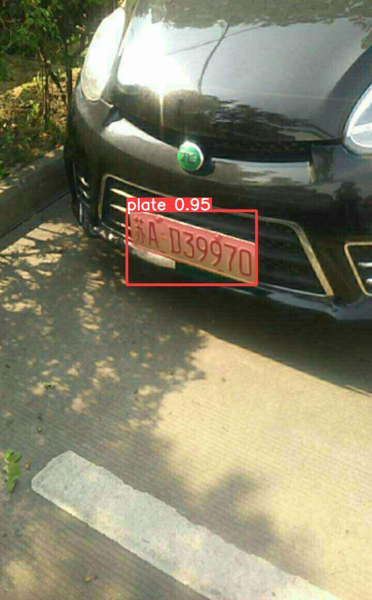
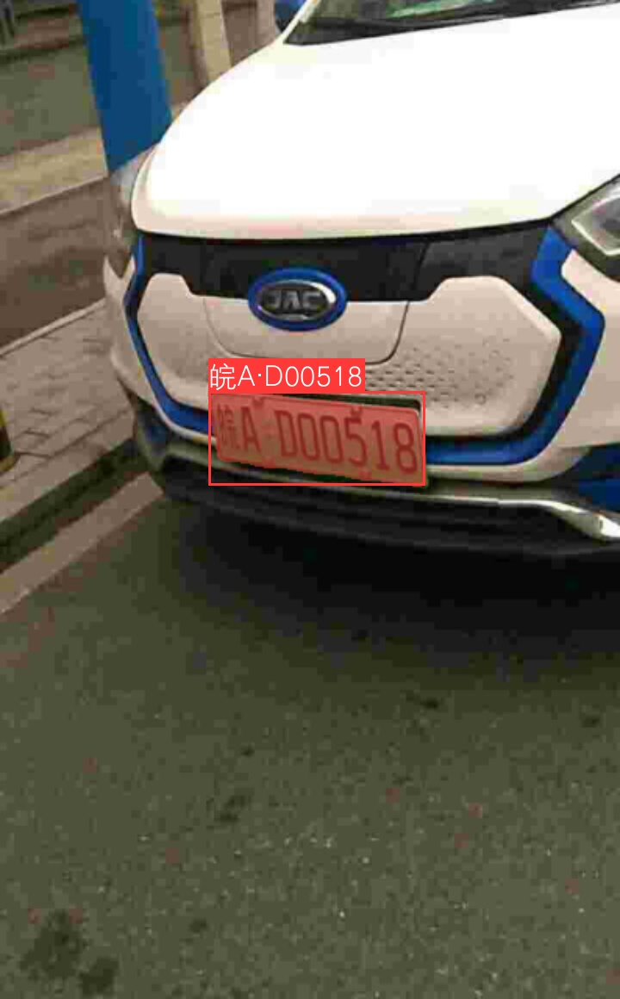

<!-- <div align="right">
  Language:
    🇺🇸
  <a title="Chinese" href="./README.zh-CN.md">🇨🇳</a>
</div> -->

<div align="center"><a title="" href="https://github.com/zjykzj/LPDet"></a></div>

<p align="center">
  «LPDet» provides a complete License Plate Detection and Recognition algorithm
<br>
<br>
  <a href="https://github.com/RichardLitt/standard-readme"></a>
  <a href="https://conventionalcommits.org"></a>
  <a href="http://commitizen.github.io/cz-cli/"></a>
</p>

Implementing license plate detection, segmentation, and recognition functions based on [YOLOv5-v7.0](https://github.com/ultralytics/yolov5/releases/tag/v7.0) and [CRNN-CTC](https://github.com/zjykzj/crnn-ctc)

## Table of Contents

- [Table of Contents](#table-of-contents)
- [News🚀🚀🚀](#news)
- [Background](#background)
- [Usage](#usage)
  - [Detect + Seg](#detect--seg)
  - [Add recognition](#add-recognition)
- [Maintainers](#maintainers)
- [Thanks](#thanks)
- [Contributing](#contributing)
- [License](#license)

## News🚀🚀🚀

| Version                                                       | Release Date | Major Updates                                                                                                                           |
|---------------------------------------------------------------|--------------|-----------------------------------------------------------------------------------------------------------------------------------------|
| [v0.3.0](https://github.com/zjykzj/LPDet/releases/tag/v0.3.0) | 2023/10/03   | Support for Automatic Mixed Precision (AMP) training.                                                                                   |
| [v0.2.0](https://github.com/zjykzj/LPDet/releases/tag/v0.2.0) | 2023/10/02   | Support for distributed training with multi-GPUs.                                                                                       |
| [v0.1.0](https://github.com/zjykzj/LPDet/releases/tag/v0.1.0) | 2023/09/29   | Reconstruct the [872699467/CCPD_CNN](https://github.com/872699467/CCPD_CNN) implementation to adapt to interfaces after Pytorch v1.0.0. |

## Background

This warehouse provides a complete license plate detection and recognition algorithm, with the goal of perfectly detecting and recognizing all license plates and license plate information.

## Usage

### Detect + Seg

Firstly, download CCPD2020([Google Drive](https://drive.google.com/file/d/1m8w1kFxnCEiqz_-t2vTcgrgqNIv986PR/view?usp=sharing)); Then, use the [ccpd2yolo.py](./ccpd2yolo.py) script to convert the dataset to YOLO format.

```shell
# Train
$ python segment/train.py --data ccpd-seg.yaml --weights yolov5n-seg.pt --img 640
# Eval
$ python segment/val.py --weights runs/yolov5n-seg_ccpd-green.pt --data ccpd-seg.yaml --img 640
# Predict
$ python segment/predict.py --weights runs/yolov5n-seg_ccpd-green.pt --source ./assets/ccpd_green/
```

 

### Add recognition

Train license plate recognition algorithm using [zjykzj/crnn-ctc](https://github.com/zjykzj/crnn-ctc)

```shell
$ git submodule add https://github.com/zjykzj/crnn-ctc.git ./crnn_ctc
```

Then predicting license plates

```shell
$ python3 segment/predict_plate.py --weights runs/yolov5n-seg_ccpd-green.pt --w-for-recog runs/crnn-plate-e100.pth --source ./assets/ccpd_green/
```

 

## Maintainers

* zhujian - *Initial work* - [zjykzj](https://github.com/zjykzj)

## Thanks

* [ultralytics/yolov5](https://github.com/ultralytics/yolov5)
* [zjykzj/crnn-ctc](https://github.com/zjykzj/crnn-ctc)
* [detectRecog/CCPD](https://github.com/detectRecog/CCPD)
* [872699467/CCPD_CNN](https://github.com/872699467/CCPD_CNN)
* [zjykzj/FastestDet](https://github.com/zjykzj/FastestDet)
* [zjykzj/YOLOv5](https://github.com/zjykzj/YOLOv5)

## Contributing

Anyone's participation is welcome! Open an [issue](https://github.com/zjykzj/LPDet/issues) or submit PRs.

Small note:

* Git submission specifications should be complied
  with [Conventional Commits](https://www.conventionalcommits.org/en/v1.0.0-beta.4/)
* If versioned, please conform to the [Semantic Versioning 2.0.0](https://semver.org) specification
* If editing the README, please conform to the [standard-readme](https://github.com/RichardLitt/standard-readme)
  specification.

## License

[Apache License 2.0](LICENSE) © 2023 zjykzj